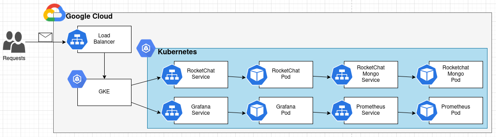

# A Scalable Microservices-based Web Application in a Public Cloud

RocketChat & Monitoring deployed in Cloud.  
Management and Administration of IT Infrastrutures and Services

The full description (Report) of the project in [Report](docs/AGI-Proj-2122-team06A.pdf)

## Authors

**TEAM 06A**

| Number  | Name              | Username                                     | Email                               |
|---------|-------------------|----------------------------------------------| ------------------------------------|
| 98678   | Bruno Freitas     | <https://git.rnl.tecnico.ulisboa.pt/ist198678> | <mailto:bruno.freitas@tecnico.ulisboa.pt>   |
| 98844   | André Barrocas    | <https://git.rnl.tecnico.ulisboa.pt/ist198844> | <mailto:andre.barrocas@tecnico.ulisboa.pt>     |
| 102108  | Ricardo Ribeiro   | <https://git.rnl.tecnico.ulisboa.pt/ist1102108> | <mailto:ricardoportoribeiro@tecnico.ulisboa.pt> |


### Module leaders

In order to implement this project all team members contributed to all project components being that Bruno focused more on `Infrastructure Resources`, André took more responsibility for `Compute Resources` and Ricardo cared more about `Application Configuration`.

## Description of the Solution


The system was made with Kubernetes to have a better satisfy the system requirements. The overall system is composed is composed as follows:



So, starting for the monitoring use case:
- The user access `grafana service` which will redirect for a `grafana pod`. This `grafana pod` will talk with `prometheus pod` that is the one who collect metrics. (all these pods are scalable, meaning it can be more that one pod for a specific service)

For the "normal" web service use case of the system, we have:
- The user access `rocketchat service` which will contact with `rocketchat-server pod` that is who is responsible for the frontend. Then, the `rocketchat-mongo service` will be contacted, which will redirect to a `rocketchat-mongo pod` to help with the access to the DB. (all these pods are scalable, meaning it can be more that one pod for a specific service)

NOTE: by default there 3 replicas of the `rocketchat-server pod` to be more scalable.


### Built With

* [Vagrant](https://www.vagrantup.com/) - HashiCorp Vagrant provides the same, easy workflow regardless of your role as a developer, operator, or designer.
* [Terraform](https://www.terraform.io/) - Terraform is an open-source infrastructure as code software tool that provides a consistent CLI workflow to manage hundreds of cloud services.
* [Docker](https://docker.com/) - Docker is the #1 most wanted and #2 most loved developer tool, and helps millions of developers build, share and run any app, anywhere - on-prem or in the cloud.
* [Google Cloud Platform](https://cloud.google.com) - Reliable and high performance cloud platform from Google.
* [Kubernetes](https://kubernetes.io) - Kubernetes is an open-source container-orchestration system for automating computer application deployment, scaling, and management. 

**Note:** Used in docker-compose version (old version)
* [Ansible](https://www.ansible.com/) - Ansible is an open source community project sponsored by Red Hat, it's the simplest way to automate IT.
* [Docker Compose](https://docs.docker.com/compose/) - Compose is a tool for defining and running multi-container Docker applications. With Compose, you use a YAML file to configure your application's services.


### Prerequisites

To run this application is required to install the following software: 

- Vagrant (latest)

- Virtualbox (latest)

To confirm that you have them installed, open a terminal and type:

```
vagrant --version

vboxmanage --version
```

<b>Vagrant</b> is necessary to create the `management machine`. This is done with a Vagrantfile that uses <b>Virtualbox</b> provider (this Vagrant file is not prepared to run on systems with architecture ARM aarch64, namely Apple Silicon M1 computers - to run this on a machine with these characteristics, another provider such as <b>Docker</b> must be used).

It is also a requirement to have a **GPC account**. With this it is possible to create a project, enable the API (see the bullet point below to further information) and then we need to download the credentials.json to the terraform folder (to authenticate the project).

* It is needed to ENABLE APIs AND SERVICES for the Project, by choosing in the Google Cloud Console API & services and next selecting the Dashboard, where it is possible to see a button on the top menu for enabling those services. Then enable `Kubernetes Engine API`.

### Project Structure

The folder structure of this project is as follows:

```
|- Vagrantfile
|- bootstrap-mgmt.sh
|- docs
|- docker-compose-version
\- tools
    \- terraform
        |- agisit-2021-rocketchat-06.json
        \- cluster
            |- gcp-gke-main.tf
            |- gcp-gke-provider.tf
            |- terraform.tfvars
            |- gcp_gke
                |	\- gcp-gke-cluster.tf
            \- gcp_k8s
                |- monitoring
                |   |- grafana.yaml
                |   \- prometheus.yaml
                |- k8s-istio.tf
                |- k8s-monitoring.tf
                |- k8s-namespaces.tf
                |- k8s-pods.tf
                |- k8s-provider.tf
                |- k8s-services.tf
                \- k8s-variables.tf
```


- At the root there is the `Vagrantfile` needed to create the management VM (`mgmt`).For this, the `bootstrap-mgmt.sh` script will be executed and, the goal of this script to install the necessary software, or in other words, prepare the management machine. The management machine will be used to do all the operations of the project.

- The `docs` folder contains the reports from all checkpoints and images.

- the `docker-compose-version` contains the previous checkpoints’ implementation.

- The `tools` folder contains all the project’s infrastructure/services files that will be deployed with the help of our `mgmt` VM. Inside of this folder there is:
  - The `terraform` folder to provision the infrastructure.  Here we have the following folders and files:
    - The json file with the credentials to be used in the deployment of thecluster. (you should change this file to the credentials of your project!).
    - The  folder  `cluster`  that  contains  everything  used  to  deploy  the  entire cluster infrastructure:
      - `gcp-gke-main.tf`, defines the modules used for the deployment and provisioning.
      - `gcp-gke-provider.tf`, defines the provider to be used.
      - `terraform.tfvars`, defines some variables used with the Terraform files.
      - `gcpgke` folder for the cluster definition file.
        - `gcp-gke-cluster.tf`, defines the cluster as well as outputs certain values.
      - `gcpk8s` folder containing the Terraform files defining the pods,  services, namespaces and other resources needed.
        - The `monitoring` folder with :
          - `grafana.yaml`, entire configuration file for the Grafana system.
          - `prometheus.yaml`, entire configuration file for the Prometheus system.
        - `k8s-istio.tf`, ISTIO Service Mesh deployment via helm charts.
        - `k8s-monitoring.tf`, deploys Grafana and Prometheus refering to the yaml files in folder monitoring.
        - `k8s-namespaces.tf`, defines namespaces used.
        - `k8s-pods.tf`, defines the Pods to be deployed
        - `k8s-provider.tf`, defines the providers that Terraform needs and certain configurations for each of them
        - `k8s-services.tf`, defines the Pods’ Services
        - `k8s-variables.tf`,  variables  to  be  used  that  are  obtained  after  the provisioning of the cluster.


### Deployment

This project was design to have a easy deployment. So,This project was design to have a easy deployment. So, So, the first thing to do is to go to the project directory and run the following commands to put up and connect to the `mgmt` - Management VM (bastion):
```
$ vagrant up
$ vagrant ssh mgmt
```

After this, inside the `mgmt`, run the following command to authenticate in the GCP (it will give a link, open it on a browser, login in with an IST account, copy the response code and past the verification code in the command line):
```
vagrant@mgmt:~$ gcloud auth login
```

Then, inside the `mgmt`, let's create the infrastructure by running the commands (first will initialize Terraform, in order to satisfy some plugion requiremnts; then it will create a plan and create the infratructure by running apply):
```
vagrant@mgmt:~/tools/terraform/cluster$ terraform init
vagrant@mgmt:~/tools/terraform/cluster$ terraform plan
vagrant@mgmt:~/tools/terraform/cluster$ terraform apply
```

After this, all the resources will be created. It is possible to see all the resources created running the command:

``kubectl get all -all-namespaces``

This command will get all information about all namespaces available.
In a briefly way, it is possible to see that what was deployed was:


- **RocketChat Pods** to handle the requests from the client (RocketChat servers).

- **RocketChat Service** to load-balance the client requests for the **RocketChat Pods**.

- **MongoDB Pods** to handle the requests from RocketChat servers (are the podscalled RocketChat-Mongo).

- **MongoDB Service** to be forward the traffic to **MongoDB Pods**.

- **Grafana Pods** to handle the requests for monitoring purposes.

- **Grafana Service** to load-balance the client requests for **Grafana Pods**.

- **Prometheus Pods** that collect metrics about the cluster and its resources.

- **Prometheus Service** to load-balance the client requests for the Prometheus Pods

After the deployment, if it is needed to use the tool `kubectl` for any purpose, first it is needed to run the following command, changing the parameters with anchors \<parameter> with the respective project data:

``
vagrant@mgmt:∼/tools/terrafo rm/cluster$gcloud  container  clustersget -credentials  <project_id > --zone <project_zone >
``

NOTES: 
* If we need more worker nodes we can change the `workers_count` variable in the file `terraform.tfvars`.
* If we need to change the region we can change it in the `region` variable in the file `terraform.tfvars`.
* If we need more replicas of the rocketchat-server or rocketchat-mongo we only need to change the `replicas` varibale in the file `k8s-pods.tf`. For grafana and prometheus the same variable should be change in their `respective.yml` file inside the monitoring folder.  If the cluster is already running it can also be added replicas using the kubernetes command line tool.


