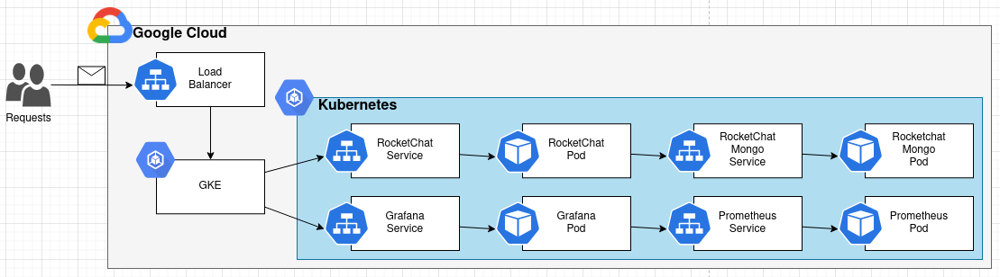
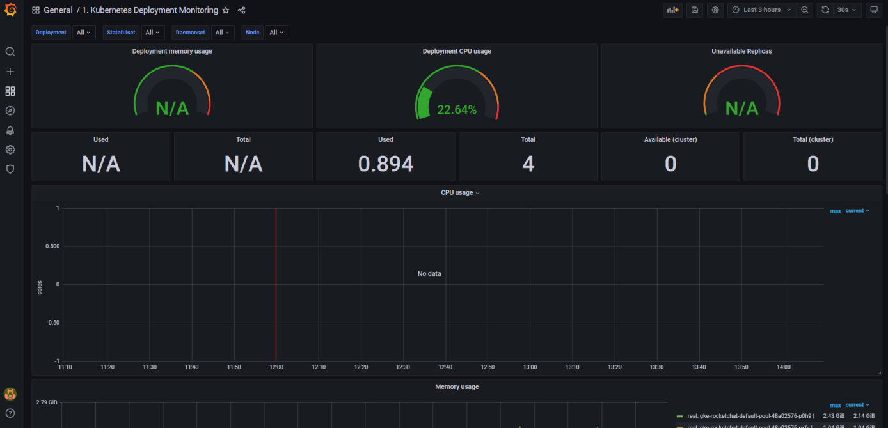
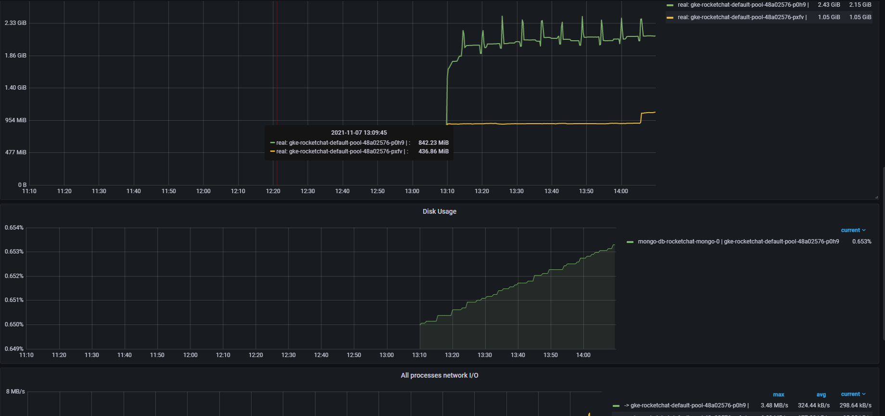

# A Scalable Microservices-based Web Application in a Public Cloud

AGISIT 2021-2022

## Table of Contents
- [Authors](#authors)
  - [Module leaders](#module-leaders)
- [Getting Started](#getting-started)
  - [Built With](#built-with)
  - [Prerequisites](#prerequisites)
  - [Project Structure](#project-structure)
  - [Deployment](#deployment)
    - [Example of Prometheus and Grafana deployed and collecting metrics](#example-of-prometheus-and-grafana-deployed-and-collecting-metrics)
- [Improvements Made](#improvements-made)
- [Versioning](#versioning)

## Authors

**TEAM 06A**

| Number  | Name              | Username                                     | Email                               |
|---------|-------------------|----------------------------------------------| ------------------------------------|
| 98678   | Bruno Freitas     | <https://git.rnl.tecnico.ulisboa.pt/ist198678> | <mailto:bruno.freitas@tecnico.ulisboa.pt>   |
| 98844   | André Barrocas    | <https://git.rnl.tecnico.ulisboa.pt/ist198844> | <mailto:andre.barrocas@tecnico.ulisboa.pt>     |
| 102108  | Ricardo Ribeiro   | <https://git.rnl.tecnico.ulisboa.pt/ist1102108> | <mailto:ricardoportoribeiro@tecnico.ulisboa.pt> |

### Module leaders

In order to implement this project all team members contributed to all project components being that Bruno focused more on `Infrastructure Resources`, André took more responsibility for `Compute Resources` and Ricardo cared more about `Application Configuration`.

## Getting Started

The system was made with Kubernetes to have a better scalability. The overall system is composed is composed as follows:



So, starting for the monitoring use case:
- The user access `grafana service` which will redirect for a `grafana pod`. This `grafana pod` will talk with `prometheus pod` that is the one who collect metrics. (all these pods are scalable, meaning it can be more that one pod for a specific service)

For the "normal" web service use case of the system, we have:
- The user access `rocketchat service` which will contact with `rocketchat-server pod` that is who is responsible for the frontend. Then, the `rocketchat-mongo service` will be contacted, which will redirect to a `rocketchat-mongo pod` to help with the access to the DB. (all these pods are scalable, meaning it can be more that one pod for a specific service)

NOTE: by default there 3 replicas of the `rocketchat-server pod` to be more scalable.

### Built With

* [Vagrant](https://www.vagrantup.com/) - HashiCorp Vagrant provides the same, easy workflow regardless of your role as a developer, operator, or designer.
* [Terraform](https://www.terraform.io/) - Terraform is an open-source infrastructure as code software tool that provides a consistent CLI workflow to manage hundreds of cloud services.
* [Docker](https://docker.com/) - Docker is the #1 most wanted and #2 most loved developer tool, and helps millions of developers build, share and run any app, anywhere - on-prem or in the cloud.
* [Google Cloud Platform](https://cloud.google.com) - Reliable and high performance cloud platform from Google.
* [Kubernetes](https://kubernetes.io) - Kubernetes is an open-source container-orchestration system for automating computer application deployment, scaling, and management. 

**Note:** Used in docker-compose version (old version)
* [Ansible](https://www.ansible.com/) - Ansible is an open source community project sponsored by Red Hat, it's the simplest way to automate IT.
* [Docker Compose](https://docs.docker.com/compose/) - Compose is a tool for defining and running multi-container Docker applications. With Compose, you use a YAML file to configure your application's services.


### Prerequisites

To run this application is required to install the following software: 

- Vagrant (latest)

- Virtualbox (latest)

To confirm that you have them installed, open a terminal and type:

```
vagrant --version

vboxmanage --version
```

<b>Vagrant</b> is necessary to create the `management machine`. This is done with a Vagrantfile that uses <b>Virtualbox</b> provider (this Vagrant file is not prepared to run on systems with architecture ARM aarch64, namely Apple Silicon M1 computers - to run this on a machine with these characteristics, another provider such as <b>Docker</b> must be used).

It is also a requirement to have a **GPC account**. With this it is possible to create a project, enable the API (see the bullet point below to further information) and then we need to download the credentials.json to the terraform folder (to authenticate the project).

* It is needed to ENABLE APIs AND SERVICES for the Project, by choosing in the Google Cloud Console API & services and next selecting the Dashboard, where it is possible to see a button on the top menu for enabling those services. Then enable `Kubernetes Engine API`.

### Project Structure

The folder structure of this project is as follows:
```
|- Vagrantfile
|- bootstrap-mgmt.sh
|- docs
\- tools
    |- ansible
    |   |- ansible.cfg
    |   |- ansible-gcp-servers-setup-all-yml
    |   |- gcphosts
    |   \- templates
    |       \- haproxy.cfg.j2
    |- scripts
    |   |- bootstrap.sh
    |   |- db_restore.sh
    |   |- deploy-grafana-prometheus.sh
    |   |- start_services.sh
    |   \- stop_services.sh
    |- docker
    |   |- grafana
    |   |   |- datasources
    |   |   |   \- prometheus_ds.yml
    |   |   \- docker-compose.yml
    |   |- prometheus
    |   |   |- docker-compose.yml
    |   |   \- config
    |   |       |- alert.yml
    |   |       \- prometheus.yml
    |   \- rocket-chat
    |       \- docker-compose.yml
    \- terraform
        |- docker-compose-version
        |   |- terraform-gcp-networks.tf
        |   |- terraform-gcp-outputs.tf
        |   |- terraform-gcp-servers.tf
        |   |- terraform-gcp-variables.tf
        |   |- terraform-provider.tf
        |   \- agisit-2021-rocketchat-06.json
        |- cluster    
        |   |- gcp_gke
        |   |   \- gcp-gke-cluster.tf
        |   |- gcp_k8s
        |   |   |- k8s-pods.tf
        |   |   |- k8s-provider.tf   
        |   |   |- k8s-services.tf
        |   |   \- k8s-variables.tf  
        |   |- gcp-gke-main.tf
        |   |- gcp-gke-provider.tf
        |   \- terraform.tfvars
        |- prometheus_grafana    
        |   |- cluster.yml       
        |   |- config-map.yml  
        |   |- grafana-datasource-config.yaml      
        |   |- grafana-deployment.yaml
        |   |- grafana-service.yaml    
        |   |- prometheus-deployment.yaml 
        |   \- prometheus-service.yaml                    
        \- agisit-2021-rocketchat-06.json
```

- At the root there is the `Vagrantfile` needed to create the management VM (`mgmt`). For this, the `bootstrap-mgmt.sh` script will be executed and, the goal of this script to install the necessary software, or in other words, prepare the management machine.

- The `docs` folder contains the report and images.

- The `tools` folder contains all the project's infrastructure/services files that will be deployed with the help of our `mgmt` VM. Inside of this folder there is:
  - The `terraform` folder to provision the infrastructure. Here we have the following folders:
    - (NOT USED IN CHECKPOINT 2) `docker-compose-version` which is the old version of the provision code (checkpoint 1)
      - `terraform-gcp-networks.tf` file specifies the security groups to allow access to the services
      - `terraform-gcp-outputs.tf` file specifies the output after doing `terraform apply` (we need to get the IP addresses of the machines and update the ansible inventory)
      - `terraform-gcp-servers.tf` file specifies the servers that will be deployed
      - `terraform-gcp-variables.tf` file defines the variables needed
      - `terraform-provider.tf` file configurates the provider
    - `cluster` folder to provision the cluster
    - `prometheus_grafana` folder to provision the grafana and prometheus
  - (NOT USED IN CHECKPOINT 2) The `ansible` folder to configure and install in the created instances all of the required applications and packages, deploy configuration files, and start the correct services
    - `gcphosts` file is the ansible inventory file
    - `ansible-gcp-servers-setup-all-yml` file configures the server instances (applies all the Plays necessary to configure the servers)
    - `ansible.cfg` file is ansible configuration file
  - The `scripts` folder that contains project managements scripts (the most important are: `bootstrap.sh` to install the necessary software for the VMs that will be created in the cloud; `db_restore.sh` that downloads the rocket-chat DB backup file restores it)
  - (NOT USED IN CHECKPOINT 2) The `docker` folder which contains the `docker-compose` projects (services that will be deployed - `rocket-chat` project which will deploy the rocket-chat webserver and the mongodb containers; `grafana` project and `prometheus` project for monitoring purposes)

**NOTE:** The folder above marked with "(NOT USED IN CHECKPOINT 2)" are still in the project so it is possible to deploy the old version (docker-compose version). The benefits of changing from docker-compose to kubernetes are explained in [Improvements Made Section](#improvements-made)

### Deployment

First go to the project directory and run the following command to put up and connect to the `mgmt` - Management VM (bastion):
```
$ vagrant up
$ vagrant ssh mgmt
```

After this, inside the `mgmt`, run the following command to authenticate in the GCP (it will give a link, open it on a browser, login in with an IST account, copy the response code and past the verification code in the command line):
```
vagrant@mgmt:~$ gcloud auth login
```

Then, inside the `mgmt`, let's create the infrastructure by running the commands (first will initialize Terraform, in order to satisfy some plugion requiremnts; then it will create a plan and create the infratructure by running apply):
```
vagrant@mgmt:~/tools/terraform/cluster$ terraform init
vagrant@mgmt:~/tools/terraform/cluster$ terraform plan
vagrant@mgmt:~/tools/terraform/cluster$ terraform apply
```

This command will create the `rocketchat-server` (which is the frontend server) and `rocketchat-mongo` (which is the backend database) Pods. The to provision the `grafana` and `prometheus` run the following script inside the `scripts` folder (first give execution permissions by running the command `chmod +x deploy-grafana-prometheus.sh`):
```
vagrant@mgmt:~/scripts$ ./deploy-grafana-prometheus.sh
```

NOTES: 
* if we need more worker nodes we can change the `workers_count` variable in the file `terraform.tfvars`.
* if we need to change the region we can change it in the `region` variable in the file `terraform.tfvars`.
* if we need more replicas of the rocketchat-server or rocketchat-mongo we only need to change the `replicas` varibale in the file `k8s-pods.tf`.

#### Example of Prometheus and Grafana deployed and collecting metrics




## Improvements Made
- The deployment process is now more autonomous and faster. In the older version was necessary to associate the IP addresses of the hosts displayed on the console in the ansible inventory file called `gcphosts` inside ansbile folder, changing the 'xxxxxxxxx' with the IP, now this process is automatic. We only need to run the commands explain in the [Deployment Section](#deployment).

- Now is possible to have multiple Pods (which contain 1 or more containers) of the rocketchat server and **mongodb**. It is also possible to have multiple pods for **grafana** and **prometheus**. (before it was only possible to have one container for each service)

- Now the project runs on `Kubernetes` instead of `Docker Compose`, making it is more easy, automatic and autoscalable.

## Versioning

We use [RNL Git](https://git.rnl.tecnico.ulisboa.pt/AGISIT-21-22/team-06A) for versioning.
