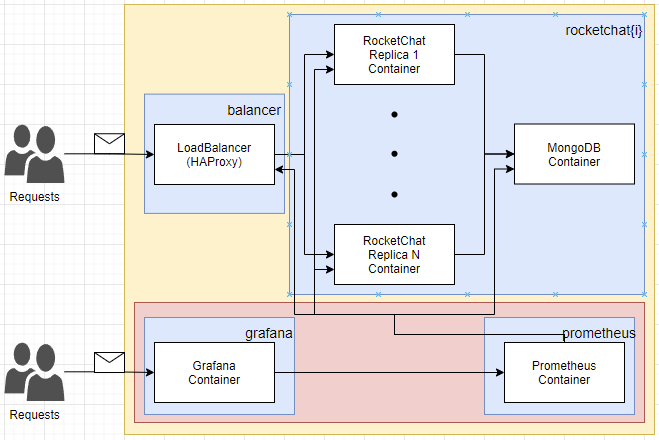

# A Scalable Microservices-based Web Application in a Public Cloud

AGISIT 2021-2022

## Table of Contents
- [Authors](#authors)
  - [Module leaders](#module-leaders)
- [Getting Started](#getting-started)
  - [Built With](#built-with)
  - [Prerequisites](#prerequisites)
  - [Project Structure](#project-structure)
  - [Deployment](#deployment)
- [Limitations](#limitations)
- [Future Work and Improvements](#future-work-and-improvements)
- [Versioning](#versioning)

## Authors

**TEAM 06A**

| Number  | Name              | Username                                     | Email                               |
|---------|-------------------|----------------------------------------------| ------------------------------------|
| 98678   | Bruno Freitas     | <https://git.rnl.tecnico.ulisboa.pt/ist198678> | <mailto:bruno.freitas@tecnico.ulisboa.pt>   |
| 98844   | André Barrocas    | <https://git.rnl.tecnico.ulisboa.pt/ist198844> | <mailto:andre.barrocas@tecnico.ulisboa.pt>     |
| 102108  | Ricardo Ribeiro   | <https://git.rnl.tecnico.ulisboa.pt/ist1102108> | <mailto:ricardoportoribeiro@tecnico.ulisboa.pt> |

### Module leaders

In order to implement this project all team members contributed to all project components being that Bruno focused more on `Infrastructure Resources`, André took more responsibility for `Compute Resources` and Ricardo cared more about `Application Configuration`.

## Getting Started

The overall system is composed is composed as follows:



The colorful boxes inside the above diagram have the following meaning:
- Yellow Box: The overall system proposed as the project
- Red Box: The monitoring system (subsystem of the project)
- Blue Boxes: Each blue box is a machine in the cloud environment (the reason why is limited to 4 is explained in the section [Limitations](#limitations))

So, starting for the monitoring use case:
- Inside the `prometheus machine` will be a `container prometheus` that is the service for monitoring. This service with the help of the grafana service for the dashboard (`grafana container` inside the `grafana machine`) will give the users the ability to gather metrics in real time from the other services of the system (rocketchat).

For the "normal" web service use case of the system, we have:
- The `balancer machine` that receives the resquests from the users and will distribute them with a `roundrobin algorithm` through the `rocketchat containers` available (inside the the `rocketchat{i} machine`, where i=1..N - for further information see [Deployment](#deployment) section).
- rocketchat containers will talk with a `mongodb container` (also inside the `rocketchat{i} machine` - the reason why is inside of this machine and its limitation is explained in the section [Limitations](#limitations)) that will manage all operations for a persistent service.

### Built With

* [Vagrant](https://www.vagrantup.com/) - HashiCorp Vagrant provides the same, easy workflow regardless of your role as a developer, operator, or designer.
* [Terraform](https://www.terraform.io/) - Terraform is an open-source infrastructure as code software tool that provides a consistent CLI workflow to manage hundreds of cloud services.
* [Ansible](https://www.ansible.com/) - Ansible is an open source community project sponsored by Red Hat, it's the simplest way to automate IT.
* [Docker](https://docker.com/) - Docker is the #1 most wanted and #2 most loved developer tool, and helps millions of developers build, share and run any app, anywhere - on-prem or in the cloud.
* [Docker Compose](https://docs.docker.com/compose/) - Compose is a tool for defining and running multi-container Docker applications. With Compose, you use a YAML file to configure your application's services.
* [Google Cloud Platform](https://cloud.google.com) - Reliable and high performance cloud platform from Google.

### Prerequisites

To run this application is required to install the following software: 

- Vagrant (latest)

- Virtualbox (latest)

To confirm that you have them installed, open a terminal and type:

```
vagrant --version

vboxmanage --version
```

<b>Vagrant</b> is necessary to create the `management machine`. This is done with a Vagrantfile that uses <b>Virtualbox</b> provider (this Vagrant file is not prepared to run on systems with architecture ARM aarch64, namely Apple Silicon M1 computers - to run this on a machine with these characteristics, another provider such as <b>Docker</b> must be used).

<!--Also is necessary to have google cloud plaform account with `tecnico.ulisboa.pt` domain.-->

NOTE: The email `rui.s.cruz@tecnico.ulisboa.pt` was added into the Google Cloud Platform project (to be possible to deploy it)

It is also a requirement to have a **GPC account**. With this it is possible to create a project, enable the API (see the bullet point below to further information) and then we need to download the credentials.json to the terraform folder (to authenticate the project).

* It is needed to ENABLE APIs AND SERVICES for the Project, by choosing in the Google Cloud Console API & services and next selecting the Dashboard, where it is possible to see a button on the top menu for enabling those services

### Project Structure

The folder structure of this project is as follows:
```
|- Vagrantfile
|- bootstrap-mgmt.sh
|- docs
\- tools
    |- ansible
    |   |- ansible.cfg
    |   |- ansible-gcp-servers-setup-all-yml
    |   |- gcphosts
    |   \- templates
    |       \- haproxy.cfg.j2
    |- scripts
    |   |- bootstrap.sh
    |   |- db_restore.sh
    |   |- start_services.sh
    |   \- stop_services.sh
    |- terraform
    |   |- terraform-gcp-networks.tf
    |   |- terraform-gcp-outputs.tf
    |   |- terraform-gcp-servers.tf
    |   |- terraform-gcp-variables.tf
    |   |- terraform-provider.tf
    |   \- agisit-2021-rocketchat-06.json
    \- docker
        |- grafana
        |   \- docker-compose.yml
        |- prometheus
        |   |- docker-compose.yml
        |   \- config
        |       |- alert.yml
        |       \- prometheus.yml
        \- rocket-chat
            \- docker-compose.yml
```

- At the root there is the `Vagrantfile` needed to create the management VM (`mgmt`). For this, the `bootstrap-mgmt.sh` script will be executed and, the goal of this script to install the necessary software, or in other words, prepare the management machine.

- The `docs` folder contains the report and images.

- The `tools` folder contains all the project's infrastructure/services files that will be deployed with the help of our `mgmt` VM. Inside of this folder there is:
  - The `terraform` folder to provision the infrastructure
    - `terraform-gcp-networks.tf` file specifies the security groups to allow access to the services
    - `terraform-gcp-outputs.tf` file specifies the output after doing `terraform apply` (we need to get the IP addresses of the machines and update the ansible inventory)
    - `terraform-gcp-servers.tf` file specifies the servers that will be deployed
    - `terraform-gcp-variables.tf` file defines the variables needed
    - `terraform-provider.tf` file configurates the provider
  - The `ansible` folder to configure and install in the created instances all of the required applications and packages, deploy configuration files, and start the correct services
    - `gcphosts` file is the ansible inventory file
    - `ansible-gcp-servers-setup-all-yml` file configures the server instances (applies all the Plays necessary to configure the servers)
    - `ansible.cfg` file is ansible configuration file
  - The `scripts` folder that contains project managements scripts (the most important are: `bootstrap.sh` to install the necessary software for the VMs that will be created in the cloud; `db_restore.sh` that downloads the rocket-chat DB backup file restores it)
  - The `docker` folder which contains the `docker-compose` projects (services that will be deployed - `rocket-chat` project which will deploy the rocket-chat webserver and the mongodb containers; `grafana` project and `prometheus` project for monitoring purposes)

### Deployment

First go to the project directory and run the following command to put up and connect to the `mgmt` - Management VM (bastion):
```
$ vagrant up
$ vagrant ssh mgmt
```

After this, inside the `mgmt`, run the following command to authenticate in the GCP (it will give a link, open it on a browser, login in with an IST account, copy the response code and past the verification code in the command line):
```
vagrant@mgmt:~$ gcloud auth login
```

Then, inside the `mgmt`, let's create the infrastructure by running the commands (first will initialize Terraform, in order to satisfy some plugion requiremnts; then it will create a plan and create the infratructure by running apply):
```
vagrant@mgmt:~/tools/terraform$ terraform init
vagrant@mgmt:~/tools/terraform$ terraform plan
vagrant@mgmt:~/tools/terraform$ terraform apply
```

All this done, just associate the IP addresses of the hosts displayed on the console in the ansible inventory file called `gcphosts` inside ansbile folder. Just change the 'xxxxxxxxx' with the IP. For example:
```
If IP displayed of grafana was 192.168.1.1
Then, the line in the inventory file should be like:
grafana             ansible_host=192.168.1.1 ansible_user=ubuntu ansible_connection=ssh
```

After this, let's configure GCP instances with ansible-playbook by running the commands:
```
vagrant@mgmt:~/tools/ansible$ ansible-playbook ansible-gcp-servers-setup-all.yml
```

NOTES: 
* the last command will configure the instances and run the services in each instance.
* if we need more replicas of the rocketchat servers we only need to change the `count` varibale in the file `terraform-gcp-servers.tf`.

## Limitations

- [Google Cloud Platform](https://cloud.google.com) (GCP) just provides 4 IPs for the project, so it is only possible to deploy 4 machines. So it was only deploy 1 machine for the Rocket-chat (because it is needed 1 machine for the Grafana, 1 machine for the Prometheus and 1 more machine for the LoadBalancer)
  - With this comes another limitation that is: we had to add the `mongodb container` inside the `rocketchat machine` as well as the N `rocketchat containers`. It is easy to see the problem: if we had more capacity to build more machines and, if we added one more `rocketchat machine` it would have its own mongodb service (this service is not synchronized with the other service of the other machine). To overcome this, we would need more IPs and then we would deploy a `db machine` that would be a centralized machine (running multiple `mongodb services` if needed) to handle all operations related with the DB (all rocketchat services would use this machine).

- `Docker Compose` is used for orchestration but has some limitations compared to other technologies like `Kubernetes`. Docker Compose can deploy multiple containers applications at the same time and it is even possible to scale some services (see more in [How to scale services using Docker Compose](https://karthi-net.medium.com/how-to-scale-services-using-docker-compose-31d7b83a6648)) but this method is "kinda" manually because we need to run a command each time we want to scale a service (for exame, running the docker-compose command with the flag ```--scale serviceX=5``` which would increase the serviceX number of containers to 5). On the other hand, Kubernetes can make it automatically (see more in [Autoscaling in Kubernetes](https://kubernetes.io/blog/2016/07/autoscaling-in-kubernetes/))

## Future Work and Improvements

**Our goal for this project was to try several tools and learn as much as possible** (and that is the reason why we chose the `Docker Compose` over `Kubernetes` as first hand). After analising the limitations, we know that Kubernetes adds more extra points (like autoscaling), although more complex. So, to further improve the project the `Docker Compose` will be changed by `Kubernetes` orchestration tool giving us more flexibility and the possibility of making an Autoscalable System.

## Versioning

We use [RNL Git](https://git.rnl.tecnico.ulisboa.pt/AGISIT-21-22/team-06A) for versioning.
